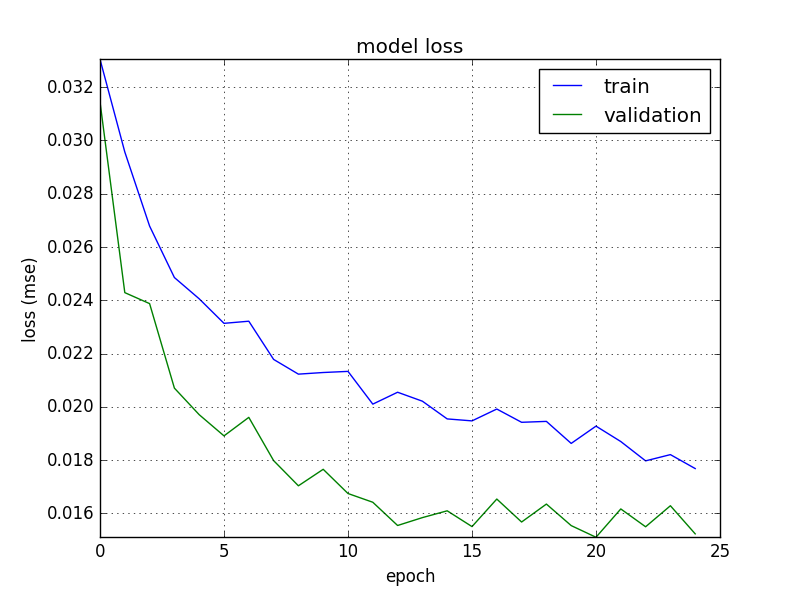

# Use Deep Learning to Clone Driving Behavior

Project for the Self-Driving Car Engineer Nanodegree Program. Date: 2017.01.29

---

## Overview

I trained a deep learning network to drive a car like me!

Using the driving simulator from Udacity I drove the car around a track, collected data and then trained deep neural network to do the driving autonomously. A video of the result is shown below.

[](https://www.youtube.com/watch?v=gQiCiNqdO7I)


## Dependencies

* TensorFlow
* Keras
* [CarND Term1 Starter Kit](https://github.com/udacity/CarND-Term1-Starter-Kit)


## Training, validation and test set

Run the simulator in the training mode and save the recorded data in the same directory. Then, with the `images_to_data.py`, create a `data.p` file to store the images and the corresponding angles into an array. Manually I moved the `data.p` file into the corresponding subfolder in `data` folder.

* The training data was obtained in the track 1 chosen like follow:

    1. `data/train/00/data.p` : This data was generated driving the car in the middle of the road for one lap in the forward direction and another one in the backward direction. This can be useful to teach the alghorithm what is the ideal path to follow. 2357 examples.

    2.`data/train/01/data.p`: the same as the above. 2431 examples. 

    2. `data/train/02/data.p`: The data generated was done recoding only when the data was recorded only when the car is driving from the side of the road back toward the center for two laps in forward direction and two laps in the backward directions. This can help to teach the car to know what to do if the driving in the middle of the road. Is worth to note that back toward situations requires only _soft movements_. 2684 examples.

    3. `data/train/03/data.p`: Similar to the above, except that the situations of back toward requires _difficult movements_. This includes driving on the dirt road. The hope is that the self-driving car knows what to do in a difficult event. 2621 examples.

    3. `data/train/04/data.p`: the same as the above. 3171 examples.

* The validation set was obtained in the track 2 chosen by:

    1. `data/cv/00/data.p`: Driving the car in the middle of the road most of the time. Occasionally recorded only when the car is driving from the side of the road back toward the center. This track is notably more difficult that the track 1. This is a good reason to use it to choose the deep learning model. 3058 examples.

* The test set is the simulator

**Note.** Instead of the `data.p` you will find `dat.mp4`. This is a video to visualize the training set. I considered this option better than only show a simple image. All the data recorded as well as the test that I done, was made with the simulator with the graphics quality: Fastest setting.

## Preprocessing
The input is an RGB image of 320 x 160 pixels:

1. Trim the image. I realize that an area of the most of the images was unnecessary, that is where not road is visible. In order to reduce the possible noise and unnecessary data I decided to cut the first 80 rows of pixels in each image. As a result of this step, RGB image of 320 x 80 pixels.

2. Grayscale image. For reason of computation resource, only one of the channels of the image was selected. As pseudorandom choose, the red channel was used.

3. Normalization. In order to avoid numerical issues and to make much easier to the optimization as said in some lesson of this ND, the image was transformed to have zero mean and equal variance.

4. Resize. As in early experiments the difference between the original size and the reducing the size by a factor of 0.5 in minimum, I resized the original image 0.5 times.

## Model architecture
This architecture used for the solution is a combination of convolutional and pooling layers followed by a two fully connected layers. In some of them, a dropout technique is used to prevent overfitting. The activation function used on each layer was *ReLu*, except in the last layer, where *tanh* activation function was used to output the predicted angle. 
In the feature extraction module, this architecture has four convolutional layers and three max-pooling layers. The regression module has four fully connected layers. This lead into a 7,783 trainable parameters and in consecuence, a fast learning model.

The details of the architecture are showing in this table: 

```text

____________________________________________________________________________________________________
Layer (type)                     Output Shape          Param #     Connected to                     
====================================================================================================
convolution2d_1 (Convolution2D)  (None, 38, 158, 3)    30          convolution2d_input_1[0][0]      
____________________________________________________________________________________________________
activation_1 (Activation)        (None, 38, 158, 3)    0           convolution2d_1[0][0]            
____________________________________________________________________________________________________
maxpooling2d_1 (MaxPooling2D)    (None, 19, 79, 3)     0           activation_1[0][0]               
____________________________________________________________________________________________________
convolution2d_2 (Convolution2D)  (None, 16, 76, 6)     294         maxpooling2d_1[0][0]             
____________________________________________________________________________________________________
activation_2 (Activation)        (None, 16, 76, 6)     0           convolution2d_2[0][0]            
____________________________________________________________________________________________________
maxpooling2d_2 (MaxPooling2D)    (None, 8, 38, 6)      0           activation_2[0][0]               
____________________________________________________________________________________________________
convolution2d_3 (Convolution2D)  (None, 6, 36, 12)     660         maxpooling2d_2[0][0]             
____________________________________________________________________________________________________
activation_3 (Activation)        (None, 6, 36, 12)     0           convolution2d_3[0][0]            
____________________________________________________________________________________________________
maxpooling2d_3 (MaxPooling2D)    (None, 3, 18, 12)     0           activation_3[0][0]               
____________________________________________________________________________________________________
convolution2d_4 (Convolution2D)  (None, 1, 16, 6)      654         maxpooling2d_3[0][0]             
____________________________________________________________________________________________________
activation_4 (Activation)        (None, 1, 16, 6)      0           convolution2d_4[0][0]            
____________________________________________________________________________________________________
flatten_1 (Flatten)              (None, 96)            0           activation_4[0][0]               
____________________________________________________________________________________________________
dense_1 (Dense)                  (None, 48)            4656        flatten_1[0][0]                  
____________________________________________________________________________________________________
activation_5 (Activation)        (None, 48)            0           dense_1[0][0]                    
____________________________________________________________________________________________________
dropout_1 (Dropout)              (None, 48)            0           activation_5[0][0]               
____________________________________________________________________________________________________
dense_2 (Dense)                  (None, 24)            1176        dropout_1[0][0]                  
____________________________________________________________________________________________________
activation_6 (Activation)        (None, 24)            0           dense_2[0][0]                    
____________________________________________________________________________________________________
dropout_2 (Dropout)              (None, 24)            0           activation_6[0][0]               
____________________________________________________________________________________________________
dense_3 (Dense)                  (None, 12)            300         dropout_2[0][0]                  
____________________________________________________________________________________________________
activation_7 (Activation)        (None, 12)            0           dense_3[0][0]                    
____________________________________________________________________________________________________
dropout_3 (Dropout)              (None, 12)            0           activation_7[0][0]               
____________________________________________________________________________________________________
dense_4 (Dense)                  (None, 1)             13          dropout_3[0][0]                  
____________________________________________________________________________________________________
activation_8 (Activation)        (None, 1)             0           dense_4[0][0]                    
====================================================================================================
Total params: 7,783
Trainable params: 7,783
Non-trainable params: 0
```


## Training process
As the problem is a regression, the mean square error (mse) as a loose function was selected. In order to reduce the number of hyper-parameters, to optimize this objective, the ADAM method was chosen.
The training process was done in a batch size of 128 samples within a maximum of 25 epochs as the early stopped method provided by Keras was used. Waiting for up to 4 epochs without improvement. The best weights are chosen considering the minimum 'mse' in the validation set during the training.
As a validation set during training a split of 0.2 of training data was used instead of the original believe of the validation set described at the beginning of this README. The reason is that the architecture proposed was not capable to generalize well in this data and didn't perform well in the training data. So, I decided to use data of the same distribution in the validation set. 

Here is a plot of the loss at each epoch during the training:


To make this plot I made the script `history_plot.py`.

## Solution design

I begin training a shadow convolution architecture (similar to the LeNet), with few data (around 4000 samples). As I saw in a test on simulation, I believe that I need more data, so collected more data. But this architecture doesn't perform well. So I decided to go deeper. I notice that as I go deeper, the number of trainable parameters decrease, the training go fast, and the performance of the network increase. At some point I noted that my filters size are causing some problems, because the pooling operation was not perfect, so y decided use, for example a mask for convolution of 4 by 4. With that modification the things went better. But as I don't have a GPU, I was only training for few epochs (about 10): Is where I decided to decrease the number of feature maps of each convolution layer. Made the net less wider, increase the performance and learning process was very fast. Then, I used the dropout technique in some layers. After some trials and errors, I decided to use only the fully connected layers.

## Observations
The training data and architecture chosen, made the car able to automatically driving the car with an acceptable performance (from my point of view), in booth, on the dirt and the paved road of training track. In another track the model is not able to drive well. In order achieve this; more experiments with different architectures need to be taken. In early experiments I tried to train on the second track and testing and the first track and although I can make the car drive automatically, doesn’t generalize well on the first track, but do it better that if I do it in another way. In other words, I believe that is better to use more difficult data to train. On the other hand I believe that if the velocity on the second track is less (maybe 20), the actual solution can work on it.
